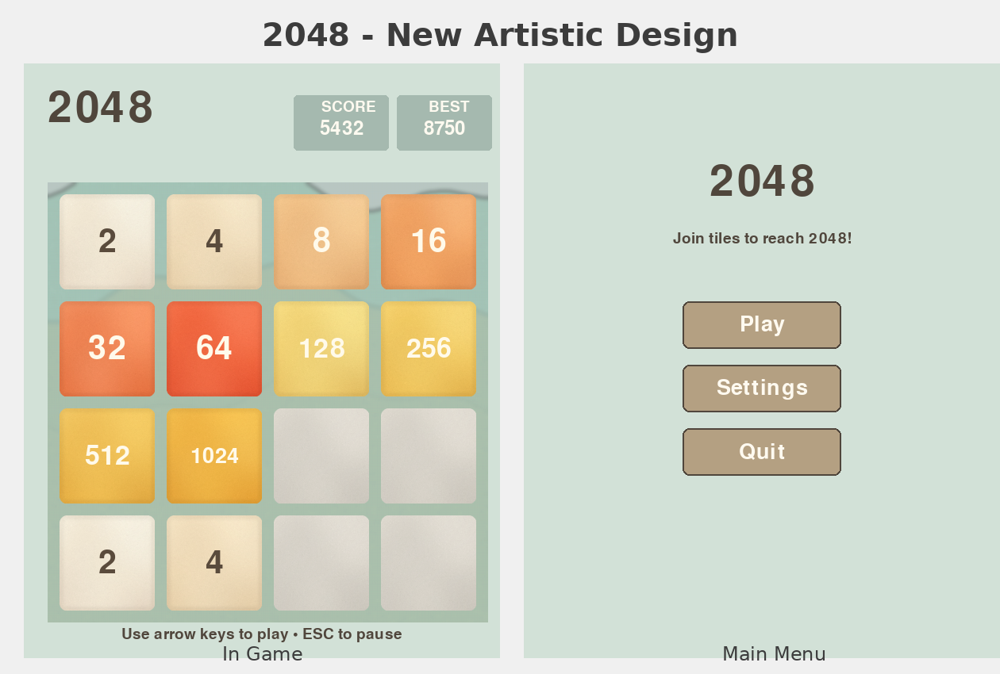

# 2048 Game - Deluxe Edition 🎮✨

Welcome to **2048 Deluxe Edition**! This is a beautifully redesigned Python-based version of the popular puzzle game with stunning visuals, smooth animations, and immersive sound effects. Combine tiles to reach the 2048 tile in this lifelike indie gaming experience!



## ✨ New Features - Deluxe Edition

### 🎨 Visual Enhancements
- **High-Quality Textures**: Beautiful gradient tiles with realistic shadows and highlights
- **Rich Visual Effects**: Subtle patterns, inner shadows, and professional lighting effects
- **Textured Background**: Elegant background with sophisticated patterns
- **Smooth UI**: Polished interface with rounded corners and modern design
- **Enhanced Typography**: Clear, readable fonts with proper contrast

### 🔊 Audio System
- **Dynamic Sound Effects**: 
  - Tile movement sounds
  - Satisfying merge effects
  - Triumphant win fanfare
  - Game over audio cues
  - Menu click feedback
  - New tile appearance sounds
- **Audio Control**: Toggle sound on/off through the settings menu

### 🎯 User Interface
- **Main Menu**: Professional start screen with Play, Settings, and Quit options
- **Settings Menu**: Control game preferences including sound toggle
- **Pause System**: Press ESC to pause/resume gameplay
- **Game Over Screens**: Beautiful win/lose overlays with score display
- **Score Tracking**: Current score and best score displays

## Project Structure 📂

```plaintext
2048/
│
├── __init__.py                       # Package initialization
├── __main__.py                       # Entry point for `python -m 2048`
├── game.py                           # Main game code with all features
├── run.py                            # Convenient run script
├── requirements.txt                  # Python dependencies
├── setup.py                          # Package setup for installation
├── MANIFEST.in                       # Package manifest
├── README.md                         # This file
│
├── tests/                            # Test suite
│   ├── __init__.py
│   ├── test_game.py                  # Unit tests for game logic
│   └── test_comprehensive.py        # Comprehensive feature tests
│
├── assets/                           # Game assets
│   ├── sounds/                       # Sound effects (WAV format)
│   │   ├── move.wav
│   │   ├── merge.wav
│   │   ├── win.wav
│   │   ├── lose.wav
│   │   ├── click.wav
│   │   └── new_tile.wav
│   ├── textures/                     # High-quality tile textures (PNG)
│   │   ├── tile_*.png                # Tiles 0, 2, 4, 8, ..., 2048
│   │   └── background.png
│   ├── generate_sounds.py            # Sound generation script
│   ├── generate_textures.py          # Original texture generator
│   └── generate_textures_artistic.py # Artistic texture generator
│
└── docs/                             # Documentation and screenshots
    ├── REDESIGN_SUMMARY.md
    ├── IMPLEMENTATION_COMPLETE.md
    ├── original_game.py              # Original version (backup)
    └── *.png                         # Screenshots
```

## How to Play 🕹️

1. **Objective**: Combine tiles with the same value to create tiles with higher values, ultimately reaching the 2048 tile.

2. **Controls**:
   - **Arrow Keys**: Slide tiles in any direction (↑ ↓ ← →)
   - **ESC**: Pause/Resume game
   - **Mouse**: Navigate menus and click buttons

3. **Game Mechanics**:
   - Each move slides all tiles in the chosen direction
   - Tiles with the same value combine to form a new tile with double the value
   - After each move, a new tile (2 or 4) appears in a random empty cell
   - Game continues until you reach 2048 (win) or have no valid moves (lose)

## Requirements 🛠️

- Python 3.6 or higher
- Pygame library
- Pillow (PIL) - for texture generation (optional, textures are pre-generated)

To install dependencies, run:
```bash
pip install -r requirements.txt
# or manually:
pip install pygame pillow
```

## How to Run ▶️

### Quick Start

1. Clone the repository:
    ```bash
    git clone https://github.com/DMelenberg/python-games.git
    cd python-games/2048
    ```

2. Install dependencies:
    ```bash
    pip install -r requirements.txt
    ```

3. Run the game (choose one method):
    ```bash
    # Method 1: Using the run script
    python run.py
    
    # Method 2: As a Python module
    python -m 2048
    
    # Method 3: Direct execution (from 2048 directory)
    cd 2048
    python game.py
    ```

### Running Tests

Run all tests:
```bash
# From the 2048 directory
python -m pytest tests/
# or
python -m unittest discover tests/
# or run individual test files
python tests/test_game.py
python tests/test_comprehensive.py
```

### Regenerating Assets (Optional)

If you want to modify and regenerate textures or sounds:
```bash
cd assets
python generate_textures_artistic.py  # Generate artistic textures
python generate_sounds.py              # Generate sound effects
```

## Features 🎮

### Core Gameplay
- **Slide and Combine**: Slide tiles in any direction and combine matching values
- **Random Tile Generation**: New tiles (2 or 4) appear after each move
- **Score Tracking**: Current score increases with each merge; best score is saved
- **Win/Lose Detection**: Automatic detection of game end conditions

### Visual Features
- **High-Quality Textures**: 256x256px gradient tiles with shadows and highlights
- **Smooth Rendering**: 60 FPS gameplay with crisp visuals
- **Professional UI**: Modern menu system with hover effects
- **Color-Coded Tiles**: Each tile value has a unique, appealing color scheme

### Audio Features
- **6 Sound Effects**: Move, merge, win, lose, click, and new tile sounds
- **Volume Control**: Sounds are balanced and pleasant
- **Toggle Option**: Easily enable/disable sound through settings menu

### Menu System
- **Main Menu**: Start game, access settings, or exit
- **Settings Menu**: Configure game preferences (sound toggle)
- **Pause Menu**: Resume, restart, or return to main menu
- **Game Over Screens**: Display final score with retry option

## Code Overview 📝

- **`Game2048` Class**: Contains the main game logic for moving tiles, combining tiles, and generating new tiles.
  - **`add_new_tile`**: Adds a new tile (2 or 4) in a random empty cell.
  - **`move_left`, `move_right`, `move_up`, `move_down`**: Functions to slide tiles in each direction.
  - **`compress`**: Helper function to handle tile merging and compressing rows.
  - **`check_game_over`**: Checks if the game is won (2048 tile) or lost (no moves left).
  - **`draw`**: Draws the game board and updates tile values on the screen.
  - **`reset`**: Resets the board to start a new game.

## Tests 🧪

The `test_2048.py` file includes unit tests to verify the main functionalities of the game:

- **test_initial_tiles**: Checks that the game starts with exactly two tiles on the grid.
- **test_move_left**: Tests that tiles slide and combine correctly when moving left.
- **test_move_right**: Tests that tiles slide and combine correctly when moving right.
- **test_game_win**: Simulates a winning condition (2048 tile) and verifies the game state.
- **test_game_over**: Tests that the game detects a loss when there are no more possible moves.

## Contributions 🤝

Contributions to improve the game or add features are welcome! Please follow these steps:

1. Fork the project.
2. Create a new branch (`git checkout -b feature/new-feature`).
3. Commit your changes (`git commit -am 'Add new feature'`).
4. Push to the branch (`git push origin feature/new-feature`).
5. Open a Pull Request.

## License 📄

This project is licensed under the MIT License. See the LICENSE file for more details.

---

Enjoy the game and good luck reaching 2048! 🎉